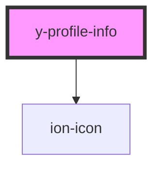

# y-profile-info

<!-- Auto Generated Below -->

## Properties

| Property             | Attribute             | Description | Type      | Default     |
| -------------------- | --------------------- | ----------- | --------- | ----------- |
| `apiKey`             | `api-key`             |             | `string`  | `undefined` |
| `channelDescription` | `channel-description` |             | `string`  | `undefined` |
| `channelImage`       | `channel-image`       |             | `string`  | `undefined` |
| `customDescription`  | `custom-description`  |             | `boolean` | `undefined` |

## Dependencies

### Depends on

- ion-icon

### Graph

----------------------------------------------

*Built with [StencilJS](https://stenciljs.com/)*
