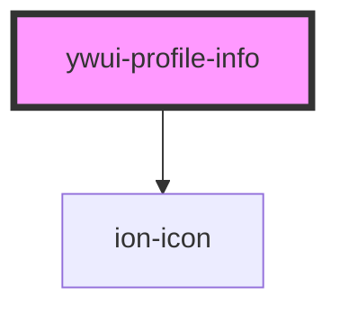

# y-profile-info

<!-- Auto Generated Below -->

## Properties

| Property          | Attribute          | Description | Type      | Default     |
| ----------------- | ------------------ | ----------- | --------- | ----------- |
| `apiKey`          | `api-key`          |             | `string`  | `undefined` |
| `channelId`       | `channel-id`       |             | `string`  | `undefined` |
| `showDescription` | `show-description` |             | `boolean` | `undefined` |

## Dependencies

### Depends on

- ion-icon

### Graph

```mermaid
graph TD;
  ywui-profile-info --> ion-icon
  style ywui-profile-info fill:#f9f,stroke:#333,stroke-width:4px
```

----------------------------------------------

*Built with [StencilJS](https://stenciljs.com/)*
